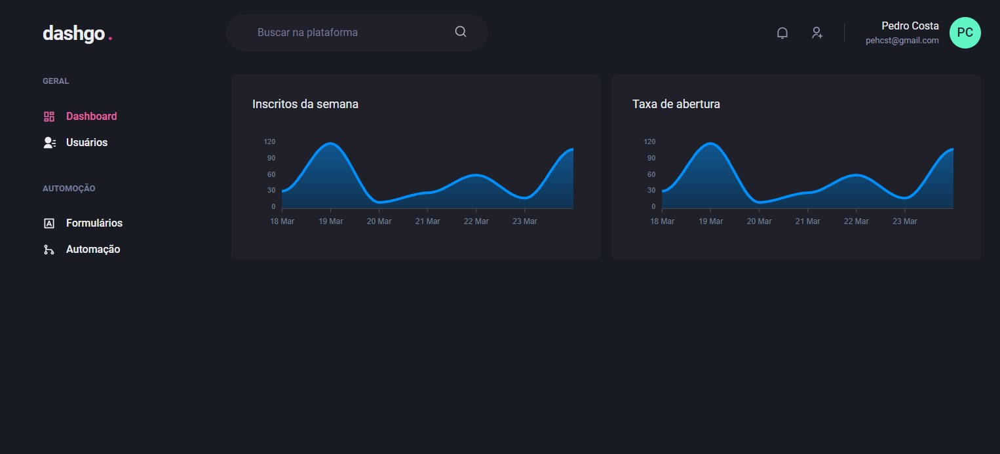

<h1 align="center">
  💻 Simple NextJS dashboard template
</h1>

## 📚 Description

In this project, an interface was developed for an administrative panel that encompasses authentication flow, dashboard, listing and registration, using Chakra UI in Next.js. 
Additionally, React Query was used to enhance the user experience by creating a data caching layer between the frontend and backend.

---

## 💼 Techs

For the development of this website I used the following technologies:

- Typescript;
- React;
- Next.js;
- Chakra UI;
- React Query;

---

<h2>About me</h2>

<table>
  <tr>
    <td align="center">
      <a href="https://github.com/pehcst">
         
        
          <b>Pedro Costa</b>
        
      </a>
    </td>
  </tr>
</table>
